# Swedish Embedded Control Toolbox

This is a control systems design library written in pure C that provides you
with advanced algorithms for control, state estimation and model identification
specifically designed for use on embedded systems. It has been adopted for use
with embedded systems and [Swedish Embedded Platform
SDK](https://github.com/swedishembedded/sdk)

It is fully compatible with Zephyr RTOS so you can simply add it as a module to
your west.yml file and start using it.

This library is focused on practical numerical methods that work best in
realtime embedded environment without any complex dependencies.

This library uses no dynamic memory allocation. All operations are done on C
arrays. The functions provided by this library are generic implementations that
can be used to implement controllers that use specific array sizes.

Original library is based on excellent work by Daniel Mårtensson who has
developed the original algorithms in C and GNU Octave.

This library provides following functionality:

- Artificial Intelligence
  - Astar algorithm for quick path finding
  - Point-in-polygon algorithm for checking if a point is inside the area
- Control Engineering
  - Kalman filter update
  - Linear Quadratic Integral regulator
  - Model predictive Control
  - Model Reference Adaptive Control
  - Transfer function to state space
  - Stability check
  - Continuous to discrete

- Filtering
  - Monte Carlo Simulation
  - Comming soon: Particle filter
  - Filtfilt 
  - Square Root Unscented Kalman Filter
  
- Linear Algebra
  - Balance matrix
  - Cholesky decomposition
  - Cholesky update
  - QR decomposition
  - LUP decomposition
  - Determinant
  - Discrete Lyapunov solver
  - Eigenvalues symmetric + Eigenvectors
  - Random real eigenvalues and random imaginary eigenvalues
  - Hankel matrix
  - Inverse
  - Pseudo inverse
  - Linear solver
  - Nonlinear solver
  - Multiplication
  - Singular Value Decomposition Golup Reinsch
  - Singular Value Decomposition Jacobi One Sided
  - Transpose
  - Matrix sum
  - Norm
  - Matrix exponential

- Miscellaneous
  - Concatenate
  - Cut matrix
  - Insert sub matrix into matrix
  - Print matrix or vector
  - Saturation
  - Sign
  - Randn
  - Mean
  - Standard deviation
  - Value min
  - Value max
  
- Optimization
  - Linear programming maximization
  - Linear programming minimization

- System Identification
  - Observer Kalman Filter identification
  - Eigensystem Realization Algorithm
  - Recursive Least Square with forgetting factor and kalman filter identification
  - Square Root Unscented Kalman Filter for parameter estimation

# How to help to build on this control toolbox

If you are interested in contributing to this library, feel free to raise a pull
request.

# GNU Octave Functions
Installing GNU Octave's Control-Toolbox or MATLAB's Control-Toolbox/System
Identification Toolbox WILL cause problems with this toolbox because they are
using the same function names. This toolbox implements better versions of the
original functions so you should either use this toolbox inside you .m file or
opt for using the default gnuoctave implementations - but not both.

# System Identification Toolbox
- OKID for multivariable hydraulic systems or temperature systems
- ERA-DC for mechanical damped systems in the time plane
- SINDY for multivariable abritary nonlinear systems
- RLS for all kind of arbitary single input and single output systems (Use this
  first!)
- OCID for linear feedback systems (I haven't found any real world practice for
  this method yet)
- FILTFILT2 for low pass filtering without phase delay
- SPA for spectral analysis
- IDBODE for mechanical damped systems in the frequency plane
- RPCA for filtering data and images
- ICA for separating signals so they are independent from each other
- SR-UKF-Parameter-Estimation for finding parameters from an very complex system
  of equation if data is available
- SR-UKF-State-Estimation for filtering noise and estimate the state of a system
- SVM for classification of data
- N4SID for MIMO, SIMO, MISO or SISO state space systems
- MOESP for MIMO, SIMO, MISO or SISO state space systems
- PIMOESP for MIMO, SIMO, MISO, or SISO state space systems

## State space model identification methods

|Function|Description|Status|Model
|--------|-----------|------|-----
|eradc|Eigensystem Realization Algorithm Data Correlation|Done|MIMO
|okid|Observer Kalman Filter Identification|Done|MIMO
|ocid|Observer Controller Identification|Done|MIMO
|rls|Recursive Least Square|Done|SISO

## Nonlinear system identification methods

|Function|Description|Status|Model
|--------|-----------|------|-----
|sindy|Sparse Identification of Nonlinear Dynamics|Done|MIMO
|sr_ukf_parameter_estimation|Estimate parameters for a nonlinear system. Notice that this is parameter estimation. Not system identification.|Done|MIMO
|sr_ukf_state_estimation|Estimate states for a nonlinear system. This is system identification|Done|MIMO

## Subspace identification algorithms

|Function|Description|Status|Model
|--------|-----------|------|-----
|moesp|Multivariable Output-Error State Space|Done|MIMO
|pimoesp|Past-Input Multivariable Output-Error State Space|Done|MIMO
|n4sid|Numerical algorithms for Subspace State Space System IDentification|Done|MIMO

## Analysis and filtering

|Function|Description|Status
|--------|-----------|------
|spa|Plot bode spectral analysis plot using Fast Fourier Transform|Done
|filtfilt2|Zero phase filtering with low pass filter|Done
|idbode|Plot bode diagram from frequency data|Done
|rpca|Filter data using Robust Principal Component Analysis|Done
|ica|Separate signals from each other so they are independent|Done

## Classification
|Function|Description|Status
|Svm|Support Vector Machine with C code generation|Done
|--------|-----------|------

# Control systems design toolbox

These functions are used for control system design.

## Model creation

|Function name|Description|Status|MIMO|TF/SS|Discrete
|-------------|-----------|------|----|-----|--------
|tf|Crate transfer function model|Done|No|N/N|Y
|zpk|Create zero-pole-gain model|Done|No|N/N|Y
|ss|Create state space model|Done|Yes|N/N|Y

## Model transformation

|Function name|Description|Status|MIMO|TF/SS|Discrete
|-------------|-----------|------|----|-----|--------
|minreal|Minimal realization|Done|Yes|Y/Y|Y
|balreal|Balanced realization|Done|Yes|N/Y|Y
|modred|Model reduction|Done|Yes|N/Y|Y
|append|Append systems|Done|Yes|Y/Y|Y
|feedback|Feedback model|Done|Yes|Y/Y|Y
|series|Serial model|Done|Yes|Y/Y|Y
|parallel|Parallel model|Done|Yes|Y/Y|Y
|pade|Internal time delay to model|Done|Yes|Y/N|Y
|referencegain|Create gain for better tracking|Done|Yes|N/Y|Y

## Model data access

|Function name|Description|Status|MIMO|TF/SS|Discrete
|-------------|-----------|------|----|-----|--------
|dcgain|Get the low frequency gain|Done|Yes|Y/Y|Y
|pzmap|Plot poles and zeros|Done|Yes|Y/Y|Y
|damp|Get the damping|Done|Yes|Y/Y|Y
|pole|Get poles|Done|Yes|Y/Y|Y
|zero|zeros for SISO |Done|No|Y/Y|Y
|tzero|zeros for MIMO |Done|Yes|N/Y|Y

## Model conversions

|Function name|Description|Status|MIMO|TF/SS|Discrete
|-------------|-----------|------|----|-----|--------
|c2d|Convert continuous to discrete|Done|Yes|Y/Y|N
|c2dt|Convert continuous to discrete with delay|Done|Yes|Y/Y|N
|d2c|Convert discrete to continuous|Done|Yes|Y/Y|Y
|d2d|Rediscrete the model|Done|Yes|Y/Y|Y
|tf2ss|Transfer function to state space|Done|No|Y/N|Y
|ss2tf|State space to transfer function|Done|Yes|N/Y|Y

## Frequency domain analysis

|Function name|Description|Status|MIMO|TF/SS|Discrete
|-------------|-----------|------|----|-----|--------
|evalfr|Get one frequency|Done|Yes|Y/Y|Y
|freqresp|Get multiple frequencies|Done|Yes|Y/Y|Y
|bode|Bode diagram|Done|Yes|Y/Y|Y
|bodemag|Bode diagram without phase|Done|Yes|Y/Y|Y
|nyquist|Nyquist diagram|Done|Yes|Y/Y|Y
|sigma|Singular value diagram|Done|Yes|Y/Y|Y
|margin|Stability margins|Done|Yes|Y/Y|Y
|allmargin|Show all margin|Done|Yes|Y/Y|Y
|sensitivity|Show sensitivity margins|Done|Yes|Y/Y|Y
|db2mag|Convert dB to magnintude|Done|Yes|Y/Y|Y
|mag2db|Conver magnintude to dB|Done|Yes|Y/Y|Y
|rlocus|Root locus plot|Done|Yes|Y/Y|Y
|rlocfind|Find the P-gain of a pole|Done|Yes|Y/Y|Y
|sgrid|Create ring and lines for damping|Done|Yes|Y/Y|Y
|findmaxgain|Compute the max gain limit|Done|Yes|Y/Y|Y
|dBdrop|Find the frequency at 3 dB drop|Done|Yes|Y/Y|Y

## Time domain analysis

|Function name|Description|Status|MIMO|TF/SS|Discrete
|-------------|-----------|------|----|-----|--------
|gensig|Generate signals|Done|No|N/N|Y
|impulse|Impulse response|Done|Yes|Y/Y|Y
|step|Step response|Done|Yes|Y/Y|Y
|ramp|Ramp response|Done|Yes|Y/Y|Y
|initial|Response with initial conditions|Done|Yes|N/Y|Y
|lsim|Linear simulation response|Done|Yes|Y/Y|Y
|satlsim|Saturation linear simulation|Done|Yes|Y/Y|Y
|nlsim|Nonlinear simulation|Done|Yes|Y/Y|Y

## Single variable control

|Function name|Description|Status|MIMO|TF/SS|Discrete
|-------------|-----------|------|----|-----|--------
|pid|Parallel PID controller|Done|No|N/N|Y
|pipd|Serial PID controller|Done|No|N/N|Y
|loop|Loopshaping controller|Done|No|Y/N|Y
|acker|Acker formula|Done|No|N/Y|Y

## Multivariable control

|Function name|Description|Status|MIMO|TF/SS|Discrete
|-------------|-----------|------|----|-----|--------
|lqr|Linear quadratic regulator|Done|Yes|N/Y|Y
|lqe|Linear quadratic estimator|Done|Yes|N/Y|Y
|lqi|Linear quadratic integral|Done|Yes|N/Y|Y
|reg|Generates the LQ-model|Done|Yes|N/Y|Y
|lqgreg|Generates the Gaussian LQG-model|Done|Yes|N/Y|Y
|lmpc|Simulate a linear Model Predictive Control|Done|Yes|N/Y|Y

## Systems of equations

|Function name|Description|Status|MIMO|TF/SS|Discrete
|-------------|-----------|------|----|-----|--------
|lyap|Solve Lyapunov equation|Done|Y|N/N|Y
|are|Solve algibraic riccati equation|Done|Y|N/Y|Y
|obsv|Observbility matrix|Done|Y|N/Y|Y
|ctrb|Controllbility matrix|Done|Y|N/Y|Y
|gram|Gramian|Done|Y|N/Y|Y
|hsvd|Hankel singular values|Done|Y|N/Y|Y
|covar|Covaraiance matrix|Done|Y|N/Y|Y

## Compensators

|Function name|Description|Status|MIMO|TF/SS|Discrete
|-------------|-----------|------|----|-----|--------
|smithpredict|Otto Smith delay compensator|Done|No|Y/N|Y
|imc|Disturbance compensator|Done|No|Y/N|Y

# Tests

This is a major TODO for this source code: there is a basic test framework in
place, but we need actual tests that verify results. Currently the tests have
form of examples which compile and run, but do not verify the results. We need
to add Unity macros for checking test results. Unity is already supported, only
the test assertions themselves need to be added.

# Papers:

This library contains realization identification and polynomal algorithms. They
can be quite hard to understand, so I highly recommend to read papers in the
"reports" folder about the realization identification algorithms if you want to
understand how they work. 

### OKID - Observer Kalman Filter Identification
OKID is an algoritm that creates the impulse makrov parameter response from
data for identify a state space model and also a kalman filter gain matrix. Use
this if you got regular data from a dynamical system. This algorithm can handle
both SISO and MISO. OKID have it's orgin from Hubble Telescope at NASA. This
algorithm was invented 1991. The drawback with OKID algorithm is that it's very
extremely sensitive to noise. So I have modify OKID by including SINDy
algorithm and Euler simulation plus Algebraic Riccati Equations for finding the
discrete kalman gain matrix K. So now it's very robust against noise.

```matlab
[sysd, K] = okid(u, y, t, sampleTime);
```

### Example OKID

Here I programmed a Beijer PLC that controls the multivariable cylinder system.
It's a nonlinear system, but OKID can handle it because it's not so nonlinear as
a hydraulic motor. Cylinder 0 and Cylinder 1 affecting each other when the
propotional control valves opens.


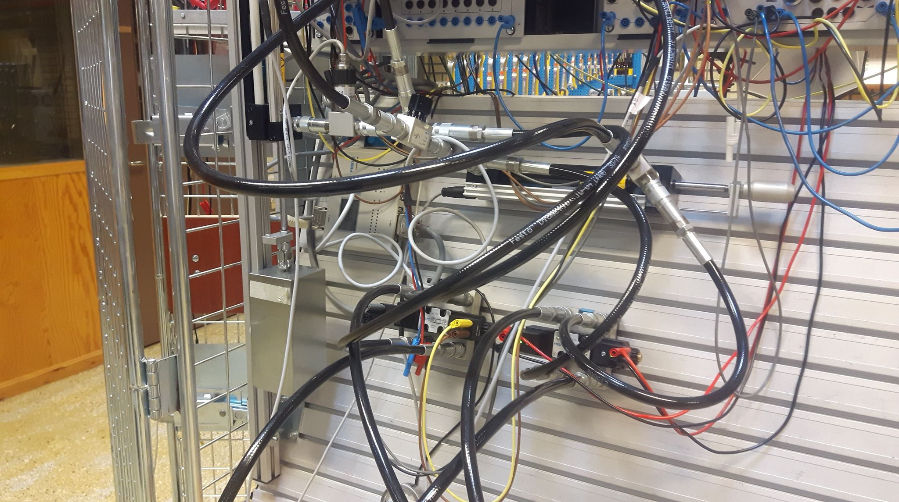


```matlab
% Load the data
X = csvread('MultivariableCylinders.csv');
t = X(:, 1);
r0 = X(:, 2);
r1 = X(:, 3);
y0 = X(:, 4);
y1 = X(:, 5);
sampleTime = 0.1;

% Transpose the CSV data
u = [r0';r1'];
y = [y0';y1'];
t = t';

% Create the model
[sysd, K] = okid(u, y, t, sampleTime);

% Do simulation
[outputs, T, x] = lsim(sysd ,y, t);
close
plot(T, outputs(1, :), t, y(1, :))
title('Cylinder 0');
xlabel('Time');
ylabel('Position');
grid on
legend('Identified', 'Measured');
ylim([0 12]);
figure
plot(T, outputs(2, :), t, y(2, :))
title('Cylinder 1');
xlabel('Time');
ylabel('Position');
grid on
legend('Identified', 'Measured');
ylim([0 12]);
```
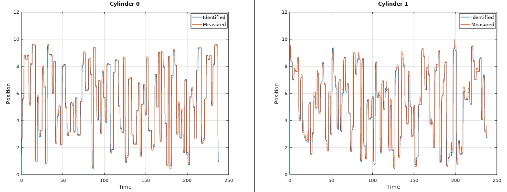

### RLS - Recursive Least Squares
RLS is an algorithm that creates a transfer function model from regular data.
Here you can select if you want to estimate an ARX model or an ARMAX model,
depending on the number of zeros in the polynomal "nze". Select number of
error-zeros-polynomal "nze" to 1, and you will get a ARX model or select "nze"
equal to model poles "np", you will get an ARMAX model that also includes a
kalman gain matrix K. I recommending that. This algorithm can handle data with
high noise, but you will only get a SISO model from it. This algorithm was
invented 1821 by Gauss, but it was until 1950 when it got its attention in
adaptive control.

Use this algorithm if you have regular data from a open loop system and you want
to apply that algorithm into embedded system that have low RAM and low flash
memory. RLS is very suitable for system that have a lack of memory.

```matlab
[sysd, K] = rls(u, y, np, nz, nze, sampleTime, forgetting);
```

### Example RLS

This is a hanging load of a hydraulic system. This system is a linear system due to the hydraulic cylinder that lift the load. Here I create two linear first order models. One for up lifting up and one for lowering down the weight. I'm also but a small orifice between the outlet and inlet of the hydraulic cylinder. That's create a more smooth behavior. Notice that this RLS algorithm also computes a Kalman gain matrix.


```matlab
% Load data
X = csvread('HangingLoad.csv');
t = X(:, 1); % Time
r = X(:, 2); % Reference 
y = X(:, 3); % Output position
u = X(:, 4); % Input signal from P-controller with gain 3
sampleTime = 0.02;
 
% Do identification of the first data set
l = length(r) + 2000; % This is half data

% Do identification on up and down
sysd_up = rls(r(1:l/2), y(1:l/2), 1, 1, 1, sampleTime);
sysd_down = rls(r(l/2+1:end), y(l/2+1:end), 1, 1, 1, sampleTime);

% Simulate 
[~,~,x] = lsim(sysd_up, r'(1:l/2), t'(1:l/2));
hold on
lsim(sysd_down, r'(l/2+1:end), t'(l/2+1:end), x(:, end));
hold on
plot(t, y);
legend('Up model', 'Down model', 'Measured');
title('Hanging load - Hydraulic system')
xlabel('Time [s]')
ylabel('Position');
````

Here we can se that the first model follows the measured position perfect. The "down-curve" should be measured a little bit longer to get a perfect linear model.

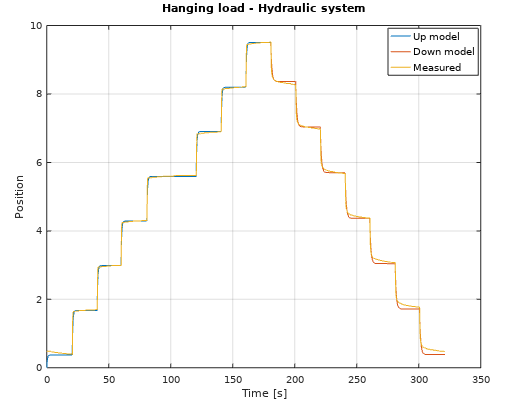

### ERA/DC - Eigensystem Realization Algorithm Data Correlations
ERA/DC was invented 1987 and is a successor from ERA, that was invented 1985 at NASA. The difference between ERA/DC and ERA is that ERA/DC can handle noise much better than ERA. But both algorihtm works as the same. ERA/DC want an impulse response. e.g called markov parameters. You will get a state space model from this algorithm. This algorithm can handle both SISO and MISO data.

Use this algorithm if you got impulse data from e.g structural mechanics.

```matlab
[sysd] = eradc(g, sampleTime, systemorder);
```
### Example ERA/DC

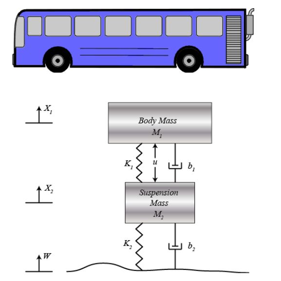

```matlab
%% Parameters
m1 = 2.3;
m2 = 3.1;
k1 = 8.5;
k2 = 5.1;
b1 = 3.3;
b2 = 5.1;

A=[0                 1   0                                              0
  -(b1*b2)/(m1*m2)   0   ((b1/m1)*((b1/m1)+(b1/m2)+(b2/m2)))-(k1/m1)   -(b1/m1)
   b2/m2             0  -((b1/m1)+(b1/m2)+(b2/m2))                      1
   k2/m2             0  -((k1/m1)+(k1/m2)+(k2/m2))                      0];
B=[0;                 
   1/m1;              
   0;                
   (1/m1)+(1/m2)];
C=[0 0 1 0];
D=[0];
delay = 0;

%% Model
buss = ss(delay,A,B,C,D);

%% Simulation
[g, t] = impulse(buss, 10);

%% Add 15% noise
load v
for i = 1:length(g)-1
  noiseSigma = 0.15*g(i);
  noise = noiseSigma*v(i); % v = noise, 1000 samples -1 to 1
  g(i) = g(i) + noise;
end

%% Identification  
systemorder = 4;
[sysd] = eradc(g, t(2) - t(1), systemorder);
    
%% Validation
gt = impulse(sysd, 10);
close
    
%% Check
plot(t, g, t, gt(:, 1:2:end))
legend("Data", "Identified", 'location', 'northwest')
grid on
```

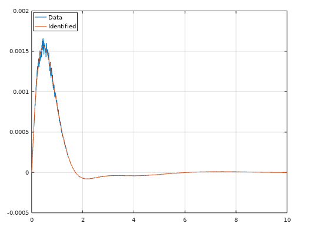


### OCID - Observer Controller Identification
This is an extention from OKID. The idea is the same, but OCID creates a LQR contol law as well. This algorithm works only for closed loop data. It have its orgin from NASA around 1992 when NASA wanted to identify a observer, model and a LQR control law from closed loop data that comes from an actively controlled aircraft wing in a wind tunnel at NASA Langley Research Center. This algorithm works for both SISO and MIMO models.

Use this algorithm if you want to extract a LQR control law, kalman observer and model from a running dynamical system. Or if your open loop system is unstable and it requries some kind of feedback to stabilize it. Then OCID is the perfect choice.

```matlab
[sysd, K, L] = ocid(r, uf, y, sampleTime, regularization, systemorder);
```


### OCID Example

```matlab
%% Matrix A
A = [0 1  0  0; 
    -7 -5 0  1; 
     0 0  0  1;
     0 1 -8 -5];
  
%% Matrix B
B = [0 0; 
     1 0; 
     0 0; 
     0 1];
  
%% Matrix C
C = [1 0 0 0; 
     0 0 0 1];
  
%% Model and signals
delay = 0;
sys = ss(delay, A, B, C);
t = linspace(0, 20, 1000);
r = [linspace(5, -11, 100) linspace(7, 3, 100) linspace(-6, 9, 100) linspace(-7, 1, 100) linspace(2, 0, 100) linspace(6, -9, 100) linspace(4, 1, 100) linspace(0, 0, 100) linspace(10, 17, 100) linspace(-30, 0, 100)];
r = [r;2*r]; % MIMO
  
%% Feedback
Q = sys.C'*sys.C;
R = [1 4; 1 5];
L = lqr(sys, Q, R);
[feedbacksys] = reg(sys, L);
yf = lsim(feedbacksys, r, t);

%% Add 10% noise
load v
for i = 1:length(yf)
  noiseSigma = 0.10*yf(:, i);
  noise = noiseSigma*v(i); % v = noise, 1000 samples -1 to 1
  yf(:, i) = yf(:, i) + noise;
end

%% Identification  
uf = yf(3:4, :); % Input feedback signals
y = yf(1:2, :); % Output feedback signals
regularization = 600;
modelorder = 4;
[sysd, K, L] = ocid(r, uf, y, t(2) - t(1), regularization, modelorder);
    
%% Validation
u = -uf + r; % Input signal %u = -Lx + r = -uf + r
yt = lsim(sysd, u, t);
close
    
%% Check
plot(t, yt(1:2, 1:2:end), t, yf(1:2, :))
legend("Identified 1", "Identified 2", "Data 1", "Data 2", 'location', 'northwest')
grid on
```

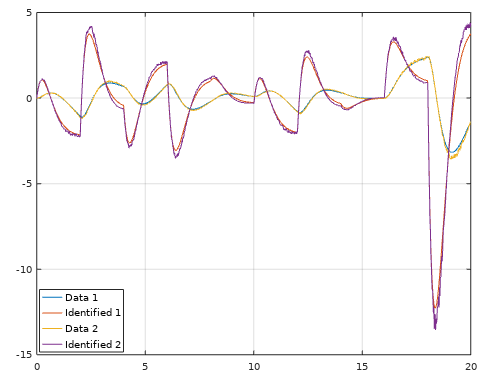


### SINDy - Sparse Identification of Nonlinear Dynamics
This is a new identification technique made by  from University of Washington. It extends the identification methods of grey-box modeling to a much simplier way. This is a very easy to use method, but still powerful because it use least squares with sequentially thresholded least squares procedure. I have made it much simpler because now it also creates the formula for the system. In more practical words, this method identify a nonlinear ordinary differential equations from time domain data.

This is very usefull if you have heavy nonlinear systems such as a hydraulic orifice or a hanging load. 

### SINDy Example

This example is a real world example with noise and nonlinearities. Here I set up a hydraulic motor in a test bench and measure it's output and the current to the valve that gives the motor oil. The motor have two nonlinearities - Hysteresis and the input signal is not propotional to the output signal. By using two nonlinear models, we can avoid the hysteresis. 

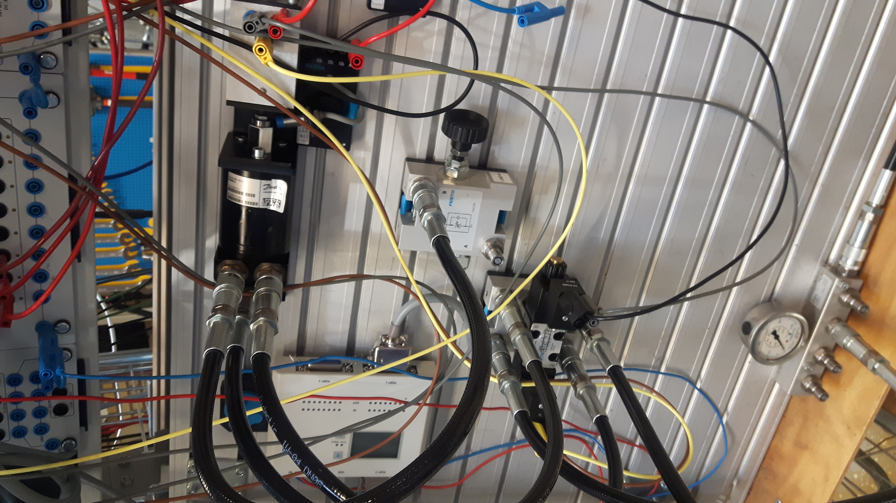

```matlab
% Load CSV data
X = csvread('MotorRotation.csv'); % Can be found in the folder "data"
t = X(:, 1);
u = X(:, 2);
y = X(:, 3);
sampleTime = 0.02;

% Do filtering of y
y = filtfilt2(y', t', 0.1)';

% Sindy - Sparce identification Dynamics
activations = [1 1 1 1 1 1 1 1 1 0 0 0 0 0 0 0 0 0 0 0 0 0 0 0 0 0 0 0 0 0 0 0 0 0 0 0 0 0 0 0 0 0 0 0 0 0 0 0 0 0 0]; % Enable or disable the candidate functions such as sin(u), x^2, sqrt(y) etc...
lambda = 0.05;
l = length(u);
h = floor(l/2);
s = ceil(l/2);
fx_up = sindy(u(1:h), y(1:h), activations, lambda, sampleTime); % We go up
fx_down = sindy(u(s:end), y(s:end), activations, lambda, sampleTime); % We go down

% Simulation up
x0 = y(1:h)(1);
u_up = u(1:h)(1:100:end)';
stepTime = 1.2;
[x_up, t] = nlsim(fx_up, u_up, x0, stepTime, 'ode15s');

% Simulation down 
x0 = y(s:end)(1);
u_down = u(s:end)(1:100:end)';
stepTime = 1.2;
[x_down, t] = nlsim(fx_down, u_down, x0, stepTime, 'ode15s');

% Compare 
close all
plot([x_up x_down])
hold on 
plot(y(1:100:end));
legend('Simulation', 'Measurement')
ylabel('Rotation')
xlabel('Time')
grid on
```

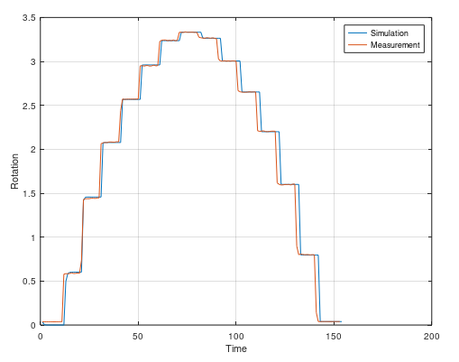

Here is a multivariable example with SINDy. It use the same data as the OKID scenario.

```matlab
% Data
X = csvread('MultivariableCylinders.csv');
t = X(:, 1);
r0 = X(:, 2); % Reference 0
r1 = X(:, 3); % Reference 1
y0 = X(:, 4); % Output 0
y1 = X(:, 5); % Output 1
sampleTime = 0.1;

% Identification
inputs = [r0 r1];
outputs = [y0 y1];
activations = [1 1 1 1 1 1 1 1 1 1 1 1 1 1 1 1 1 1 1 1 1 1 1 1 1 1 1 1 1 1 1 1 1 1 1 1 1 1 1 1 1 1 1 1 1 1 1 1 1 1 1 1 1 1 1 1 1 1 1 1 1 1 1 1 1 1 1 1 1 1 1 1 1 1 1 1 1 1 1 1 1 1 1 1 1 1 1 1 1 1 1 1 1 1 1 1 1 1 0 0 0 0 0 0 0 0 0 0 0 0 0 0 0 0 0 0 0 0 0 0 0 0 0 0 0];
lambda = 0.2;
model = sindy(inputs, outputs, activations, lambda, sampleTime);

% Simulation
u = inputs';
x0 = outputs'(:, 1);
stepTime = 1.0;
[x, t] = nlsim(model, u, x0, stepTime, 'ode15s');

% Compare
close all 
plot(x(1, :))
hold on 
plot(y0)
legend('Simulation', 'Measurement')
ylabel('Position')
xlabel('Time')
title('Cylinder 0')
grid on

figure
plot(x(2, :))
hold on 
plot(y1)
legend('Simulation', 'Measurement')
ylabel('Position')
xlabel('Time')
title('Cylinder 1')
grid on
```

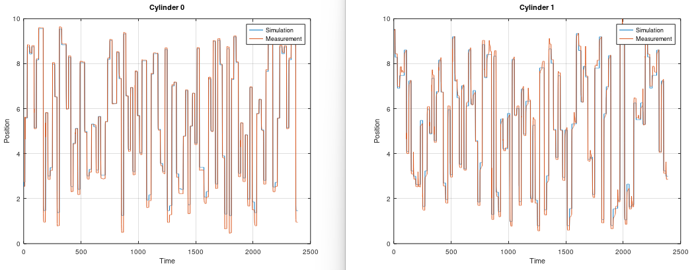

### IDBode - Identification Bode
This plots a bode diagram from measurement data. It can be very interesting to
see how the amplitudes between input and output behaves over frequencies. This
can be used to confirm if your estimated model is good or bad by using the
`bode` command from this toolbox and compare it with idebode.

```matlab
idbode(u, y, w);
```

### IDBode Example

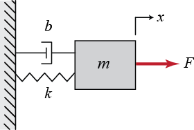

```matlab
%% Model of a mass spring damper system
M = 5; % Kg
K = 100; % Nm/m
b = 52; % Nm/s^2
G = tf([1], [M b K]);

%% Frequency response
t = linspace(0.0, 50, 3000);
w = linspace(0, 100, 3000);
u = 10*sin(2*pi*w.*t);

%% Simulation
y = lsim(G, u, t);
close

%% Identify bode diagram
idbode(u, y, w);

%% Check
bode(G);
```

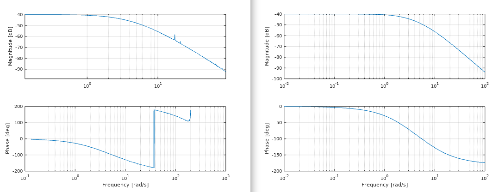

### SPA - Spectral Analysis
This plots all the amplitudes from noisy data over its frequencies. Very good to see what type of noise or signals you have. With this, you can determine what the real frequencies and amplitudes are and therefore you can create your filtered frequency response that are clean.

```matlab
[amp, wout] = spa(y, t);
```

### SPA Example

Assume that we are using the previous example with different parameters.

```matlab
%% Model of a mass spring damper system
M = 1; % Kg
K = 500; % Nm/m
b = 3; % Nm/s^2
G = tf([1], [M b K]);

%% Frequency response
t = linspace(0.0, 100, 30000);
u1 = 10*sin(2*pi*5.*t); % 5 Hz
u2 = 10*sin(2*pi*10.*t); % 10 Hz
u3 = 10*sin(2*pi*20.*t); % 20 Hz
u4 = 10*sin(2*pi*8.*t); % 8 Hz
u = u1 + u2 + u3 + u4;

%% Simulation
y = lsim(G, u, t);
figure

%% Noise
y = y + 0.001*randn(1, 30000); 

%% Identify what frequencies we had!
spa(y, t);
```

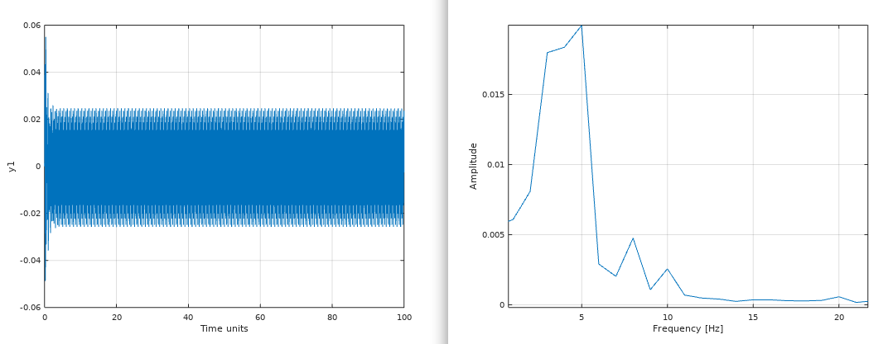

### Filtfilt2 - Zero Phase Filter
This filter away noise with a good old low pass filter that are being runned twice. Filtfilt2 is equal to the famous function filtfilt, but this is a regular .m file and not a C/C++ subroutine. Easy to use and recommended. 

```matlab
[y] = filtfilt2(y, t, K);
```

### Filtfilt2 Example

We are using the previous example here as well.

```matlab
%% Model of a mass spring damper system
M = 1; % Kg
K = 500; % Nm/m
b = 3; % Nm/s^2
G = tf([1], [M b K]);

%% Input signal
t = linspace(0.0, 100, 3000);
u = 10*sin(t);

%% Simulation
y = lsim(G, u, t);

%% Add 10% noise
load v
for i = 1:length(y)
  noiseSigma = 0.10*y(i);
  noise = noiseSigma*v(i); % v = noise, 1000 samples -1 to 1
  y(i) = y(i) + noise;
end

%% Filter away the noise
lowpass = 0.2;
[yf] = filtfilt2(y, t, lowpass);

%% Check
plot(t, yf, t, y);
legend("Filtered", "Noisy");
```
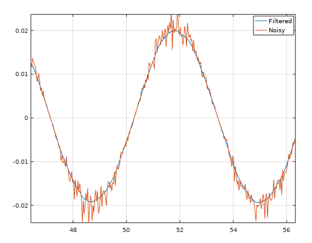

### Robust Principal Component Analysis
Robust principal component analysis(RPCA) is a great tool if you want to separate noise from data `X` into a matrix `S`. `RPCA` is a better tool than `PCA` because it using optimization and not only reconstructing the image using `SVD`, which `PCA` only does.

```matlab
[L, S] = rpca(X);
```
### Robust Principal Component Analysis example

```matlab
X = imread('bob.jpg'); % Load Mr Bob
X = rgb2gray(X);       % Grayscale 8 bit
X = double(X);         % Must be double 40 => 40.0
[L, S] = rpca(X);      % Start RPCA. Our goal is to get L matrix
figure(1)
imshow(uint8(X))       % Before RPCA
title('Before RPCA - Bob')
figure(2)
imshow(uint8(L))       % After RPCA
title('After RPCA - Bob')
```

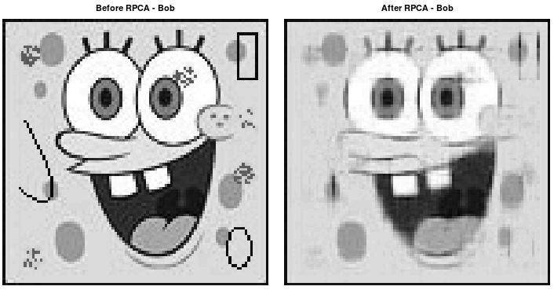

### Independent Component Analysis
Independent component analysis(ICA) is a tool if you want to separate independent signals from each other. This is not a filter algorithm, but instead of removing noise, it separate the disturbances from the signals. The disturbances are created from other signals. Assume that you have an engine and you are measuring vibration in X, Y and Z-axis. These axis will affect each other and therefore the signals will act like they are mixed. ICA separate the mixed signals into clean and independent signals.

```matlab
[S] = ica(X);
```
### Independent Component Analysis example

```matlab
% Clear all plots
clear
close all
clc

% Tick clock
tic

%% Parameters
N = 6;                            %The number of observed mixtures
M = 1000;                         %Sample size, i.e.: number of observations

K = 0.1;                          %Slope of zigzag function
na = 8;                           %Number of zigzag oscillations within sample
ns = 5;                           %Number of alternating step function oscillations within sample

finalTime = 40*pi;                %Final sample time (s)
initialTime = 0;                  %Initial sample time (s)

%% Generating Data for ICA
% Create time vector data
timeVector  = initialTime:(finalTime-initialTime)/(M-1):finalTime;

% Create random, cos, sin and fast cos signal
source1     = rand(1, M);                   
source2     = cos(0.25*timeVector);         
source3     = sin(0.1*timeVector);          
source4     = cos(0.7*timeVector);          

% Ziggsack signal
source5 = zeros(1,M);   
periodSource5 = (finalTime-initialTime)/na; 
for i = 1:M
    source5(i) = K*timeVector(i)-floor(timeVector(i)/periodSource5)*K*periodSource5;
end
source5 = source5 - mean(source5);

% PWM signal
source6 = zeros(1,M);  
periodSource6 = (finalTime-initialTime)/ns/2;
for i = 1:M
    if mod(floor(timeVector(i)/periodSource6),2) == 0
        source6(i) = 1;
    else
        source6(i) = -1;
    end    
end

source6 = source6 - mean(source6);

% Create our source matrix. This matrix is what want to find
S = [source1;source2;source3;source4;source5;source6];

% Create an matrix A that going to mix all signals in S, that we calling X
Amix = rand(N,N);                    
X = Amix*S;                                 

figure
plot(timeVector,source1)                    
xlabel('time (s)')
ylabel('Signal Amplitude') 
legend('source 1')

figure
plot(timeVector,source2)                    
xlabel('time (s)')
ylabel('Signal Amplitude') 
legend('source 2')

figure
plot(timeVector,source3)                    
xlabel('time (s)')
ylabel('Signal Amplitude') 
legend('source 3')

figure
plot(timeVector,source4)                    
xlabel('time (s)')
ylabel('Signal Amplitude') 
legend('source 4')

figure
plot(timeVector,source5)                   
xlabel('time (s)')
ylabel('Signal Amplitude') 
legend('source 5')

figure
plot(timeVector,source6)                    
xlabel('time (s)')
ylabel('Signal Amplitude') 
legend('source 6')

figure
plot(timeVector,X);                      
xlabel('time (s)') 
ylabel('Signal Amplitude')
legend('Observed Mixture 1', 'Observed Mixture 2', 'Observed Mixture 3', 'Observed Mixture 4', 'Observed Mixture 5', 'Observed Mixture 6')

% Use ICA to find S from X
S = ica(X);

figure
plot(timeVector, S(1,:))
xlabel('time (s)') 
ylabel('Signal Amplitude') 
legend('Source Estimation 1')

figure
plot(timeVector, S(2,:))
xlabel('time (s)') 
ylabel('Signal Amplitude') 
legend('Source Estimation 2')

figure
plot(timeVector, S(3,:))
xlabel('time (s)')
ylabel('Signal Amplitude') 
legend('Source Estimation 3')

figure
plot(timeVector, S(4,:))
xlabel('time (s)')
ylabel('Signal Amplitude') 
legend('Source Estimation 4')

figure
plot(timeVector, S(5,:))
xlabel('time (s)')
ylabel('Signal Amplitude') 
legend('Source Estimation 5')

figure
plot(timeVector, S(6,:))
xlabel('time (s)')
ylabel('Signal Amplitude') 
legend('Source Estimation 6')

% End clock time and check the difference how long it took
toc
```

These signals are what we want to find

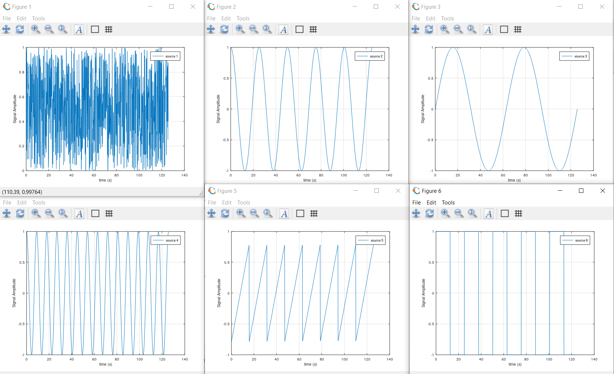

This is how the signals look when we are measuring them

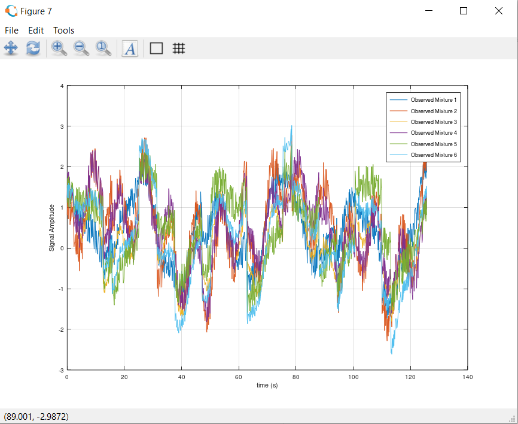

This is how the signals are reconstructed as they were independent

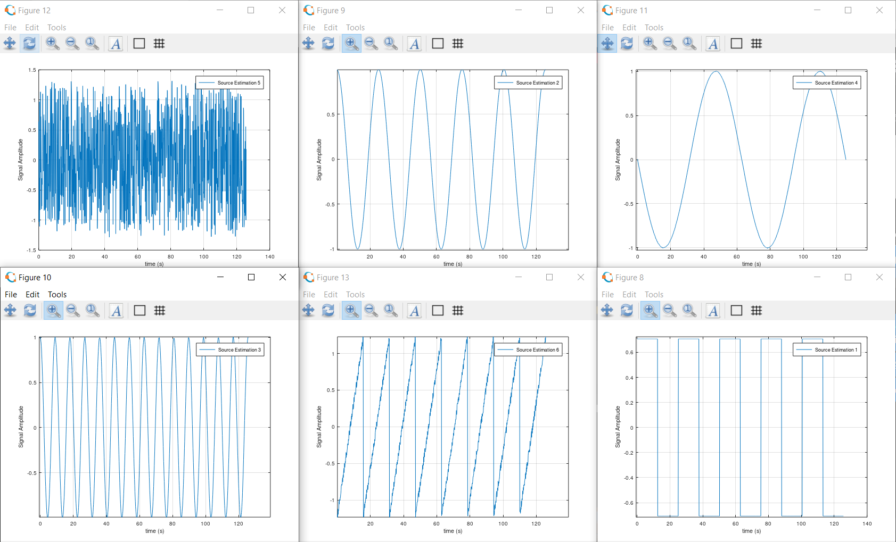

### Square Root Uncented Kalman Filter for parameter estimation

This is Uncented Kalman Filter that using cholesky update method (more stable),
instead of cholesky decomposition. This algorithm can estimate parameters to
very a complex function if data is available. This method is recursive and
implemented in this repository in C as well. Use this when you need to estimate
parameters to a function if you have data that are generated from that function.
It can be for example an object that you have measured data and you know the
mathematical formula for that object. Use the measured data with this algorithm
and find the parameters for the formula.

```matlab
[Sw, what] = sr_ukf_parameter_estimation(d, what, Re, x, G, lambda_rls, Sw, alpha, beta, L);
```

### Square Root Uncented Kalman Filter for parameter estimation example
```matlab
% Initial parameters
L = 3;                  % How many states we have
e = 0.1;                % Tuning factor for noise
alpha = 0.1;            % Alpha value - A small number like 0.01 -> 1.0
beta = 2.0;             % Beta value - Normally 2 for gaussian noise
Re = e*eye(L);          % Initial noise covariance matrix - Recommended to use identity matrix
Sw = eye(L);            % Initial covariance matrix - Recommended to use identity matrix
what = zeros(L, 1);     % Estimated parameter vector
d = zeros(L, 1);        % This is our measurement
x = [4.4; 6.2; 1.0];    % State vector
lambda_rls = 1.0;       % RLS forgetting parameter between 0.0 and 1.0, but very close to 1.0

% Our transition function - This is the orifice equation Q = a*sqrt(P2 - P1) for hydraulics
G = @(x, w) [w(1)*sqrt(x(2) - x(1));
            % We only need to use w(1) so we assume that w(2) and w(3) will become close to 1.0 
             w(2)*x(2);
             w(3)*x(3)];
             
% Start clock time
tic

% Declare arrays 
samples = 100;
WHAT = zeros(samples, L);
E = zeros(samples, L);

% Do SR-UKF for parameter estimation
for i = 1:samples
  % Assume that this is our measurement 
  d(1) = 5 + e*randn(1,1);
  
  % This is just to make sure w(2) and w(3) becomes close to 1.0
  d(2) = x(2);
  d(3) = x(3);
  
  % SR-UKF
  [Sw, what] = sr_ukf_parameter_estimation(d, what, Re, x, G, lambda_rls, Sw, alpha, beta, L);
  
  % Save the estimated parameter 
  WHAT(i, :) = what';
  
  % Measure the error
  E(i, :) = abs(d - G(x, what))';
end

% Stop the clock
toc 

% Print the data
[M, N] = size(WHAT);

for k = 1:N                                 
  subplot(3,1,k);
  plot(1:M, WHAT(:,k), '-', 1:M, E(:, k), '--');
  title(sprintf('Parameter estimation for parameter w%i', k));
  ylabel(sprintf('w%i', k));
  grid on
  legend('Estimated parameters', 'Parameter error')
end
```

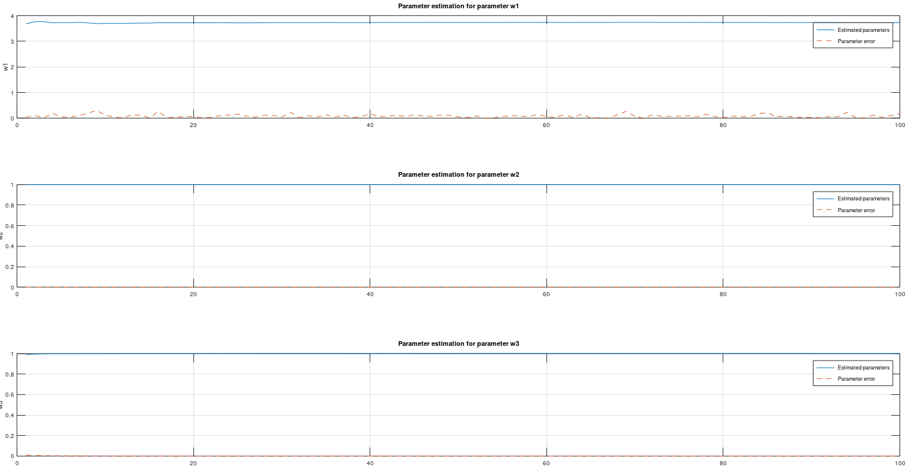

### Square Root Uncented Kalman Filter for state estimation

This is Uncented Kalman Filter that using cholesky update method (more stable),
instead of cholesky decomposition. This algorithm can estimate states from a
very complex model. This method is reqursive and implemented in this repository
in C as well. Use this when you need to estimate state to a model if you have
data that are generated from that function. It can be for example an object
that you have measured data and you know the mathematical formula for that
object. Use the measured data with this algorithm and find the states for the
model.

```matlab
[S, xhat] = sr_ukf_state_estimation(y, xhat, Rn, Rv, u, F, S, alpha, beta, L);
```

### Square Root Uncented Kalman Filter for state estimation example
```matlab
% Initial parameters
L = 3;                  % How many states we have
r = 1.5;                % Tuning factor for noise
q = 0.2;                % Tuning factor for disturbance
alpha = 0.1;            % Alpha value - A small number like 0.01 -> 1.0
beta = 2.0;             % Beta value - Normally 2 for gaussian noise
Rv = q*eye(L);          % Initial disturbance covariance matrix - Recommended to use identity matrix
Rn = r*eye(L);          % Initial noise covariance matrix - Recommended to use identity matrix
S = eye(L);             % Initial covariance matrix - Recommended to use identity matrix
xhat = [0; 0; 0];       % Estimated state vector
y = [0; 0; 0];          % This is our measurement
u = [0; 0; 0];          % u is not used in this example due to the transition function not using an input signal
x = [0; 0; 0];          % State vector for the system (unknown in reality)

% Our transition function
F = @(x, u) [x(2);
             x(3);
             0.05*x(1)*(x(2) - x(3))];
             
% Start clock time
tic

% Declare arrays 
samples = 200;
X = zeros(samples, L);
XHAT = zeros(samples, L);
Y = zeros(samples, L);
phase = [90;180;140];
amplitude = [1.5;2.5;3.5];

% Do SR-UKF for state estimation
for i = 1:samples
  % Create measurement 
  y = x + r*randn(L, 1);
  
  % Save measurement 
  Y(i, :) = y';
 
  % Save actual state
  X(i, :) = x';
  
  % SR-UKF
  [S, xhat] = sr_ukf_state_estimation(y, xhat, Rn, Rv, u, F, S, alpha, beta, L);

  % Save the estimated parameter 
  XHAT(i, :) = xhat';
  
  % Update process
  x = F(x, u) + q*amplitude.*sin(i-1 + phase);
end

% Stop the clock
toc 

% Print the data
[M, N] = size(XHAT);

for k = 1:N                                 
  subplot(3,1,k);
  plot(1:M, Y(:,k), '-g', 1:M, XHAT(:, k), '-r', 1:M, X(:, k), '-b');
  title(sprintf('State estimation for state x%i', k));
  ylabel(sprintf('x%i', k));
  grid on
  legend('y', 'xhat', 'x')
end
```

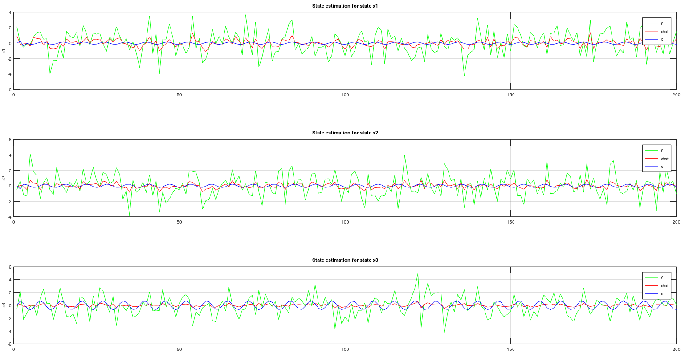

### Support Vector Machine with C code generation

This algorithm can do C code generation for nonlinear models. It's a very simple
algorithm because the user set out the support points by using the mouse
pointer. When all the supports are set ut, then the algorithm will generate C
code for you so you can apply the SVM model in pure C using supplied C
implementation in this repository.

All you need to have is two matrices, `X` and `Y`. Where the column length is the data and the row length is the amount of classes.
The `svm.m` file will plot your data and then when you have placed out your support points, then the `svm.m` will generate C code for you that contains all the support points.

If you have let's say more than two variables, e.g `Z` matrix or even more. Then you can create multiple models as well by just using diffrent data as arguments for the `svm` function below. The C code generation is very fast and it's very easy to build a model. 

```matlab
[X_point, Y_point, amount_of_supports_for_class] = svm(X, Y)
```

### Support Vector Machine with C code generation example

```matlab
% How much data should we generate 
N = 50;

% How many classes 
c = 5;

% Create variance and average for X and Y data
X_variance = [2, 4, 3, 4, 5];
Y_variance = [3, 5, 3, 4, 5];
X_average = [50, 70, 10, 90, 20];
Y_average = [20, 70, 60, 10, 20];

% Create scatter data
X = zeros(c, N);
Y = zeros(c, N);
for i = 1:c
  % Create data for X-axis 
  X(i, 1:N) = X_average(i) + X_variance(i)*randn(1, N);
    
  % Create data for Y-axis
  Y(i, 1:N) = Y_average(i) + Y_variance(i)*randn(1, N);
end
  
% Create SVM model - X_point and Y_point is coordinates for the SVM points.
% amount_of_supports_for_class is how many points there are in each row
[X_point, Y_point, amount_of_supports_for_class] = svm(X, Y);
  
% Do a quick re-sampling of random data again
for i = 1:c
  % Create data for X-axis 
  X(i, 1:N) = X_average(i) + X_variance(i)*randn(1, N);
    
  % Create data for Y-axis
  Y(i, 1:N) = Y_average(i) + Y_variance(i)*randn(1, N);
end
  
% Check the SVM model
point_counter_list = zeros(1, c);
for i = 1:c
  % Get the points 
  svm_points_X = X_point(i, 1:amount_of_supports_for_class(i));
  svm_points_Y = Y_point(i, 1:amount_of_supports_for_class(i));
    
  % Count how many data points this got - Use inpolygon function that return 1 or 0 back
  point_counter_list(i) = sum(inpolygon(X(i,:) , Y(i, :), svm_points_X, svm_points_Y));
end
  
% Plot how many each class got - Maximum N points per each class
figure 
bar(point_counter_list);
xlabel('Class index');
ylabel('Points');
```

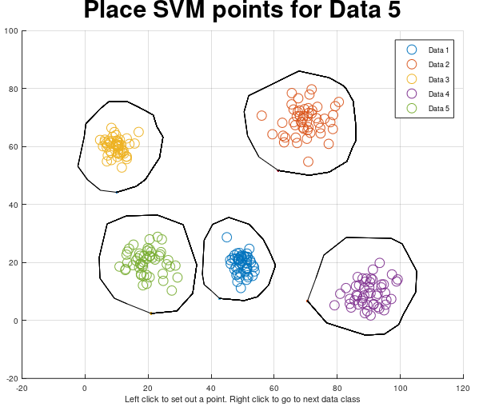

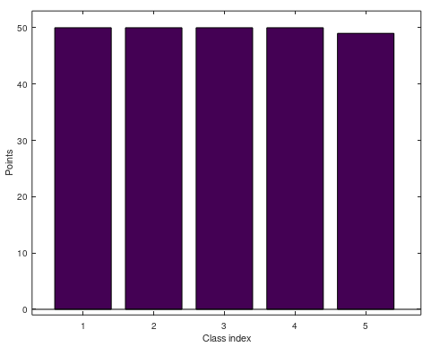


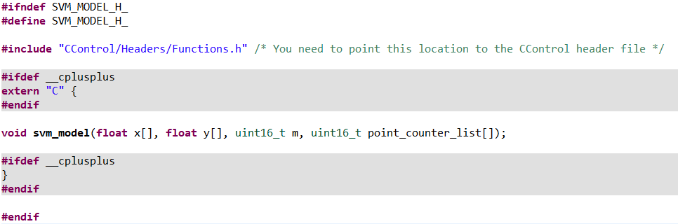

# Typical use

To use control library functions, you should allways start with to create a
transfer function or a state space model. Then you can use that mathematical
model in almost all of the control system design functions. 

Here are some examples of using the control system design functions.

MATLAB pictures are from Umeå University.

Creating a transfer function in MATLAB®


Creating a transfer function in GNU Octave


Create a bode diagram plot in MATLAB®


Create a bode diagram plot in GNU Octave


Create a state space model in MATLAB®


Create a state space model in GNU Octave 


Do a step simulation in MATLAB®


Do a step simulation in GNU Octave


Convert a time continuous transfer function to a discrete transfer function in MATLAB®


Convert a time continuous transfer function to a discrete transfer function in GNU Octave


Do a nyquist diagram plot in MATLAB®


Do a nyquist diagram plot in GNU Octave


# Model Predictive Control - Linear programming

Here I use MPC with linear programming. I used to use MPC with a quadratic programming, but unfortunately quadprog is only available for MATLAB and you need to have a license for that. So I wrote my own linear programming MPC with regularization for smoother outputs and inputs. The linear programming algorithm is available in C code as well in my other projects for embedded MPC systems, and that's the main reason why I selected a simple optimization solver instead of a large and difficult one.

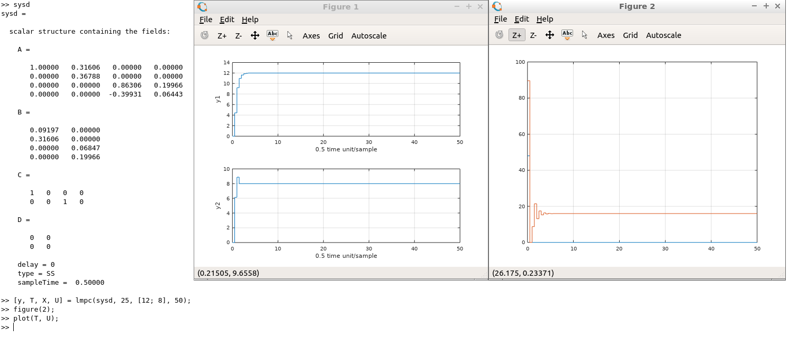

# Usage with Octave

To use these algorithms in GNU octave, just add the path to the octave source
code to your octave project:

Example:
```matlab
path('/path/to/control/octave/systemid', path)
path('/path/to/control/octave/control', path)
savepath
```

# Square Root Uncented Kalman Filter for state estimation and parameter estimation

This is the latest Uncented Kalman Filter. MATLAB is using the same algorithm. A
`.m` file is available at the `SR-UKF` folder.

For state estimation


For parameter estimation


